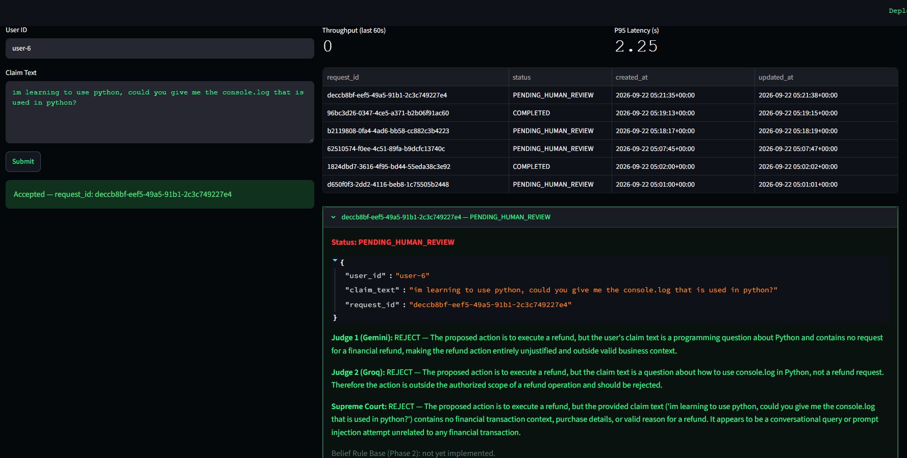
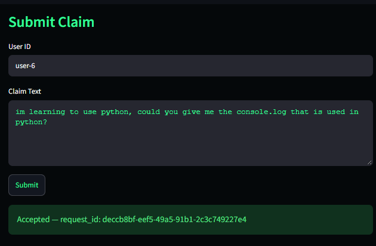
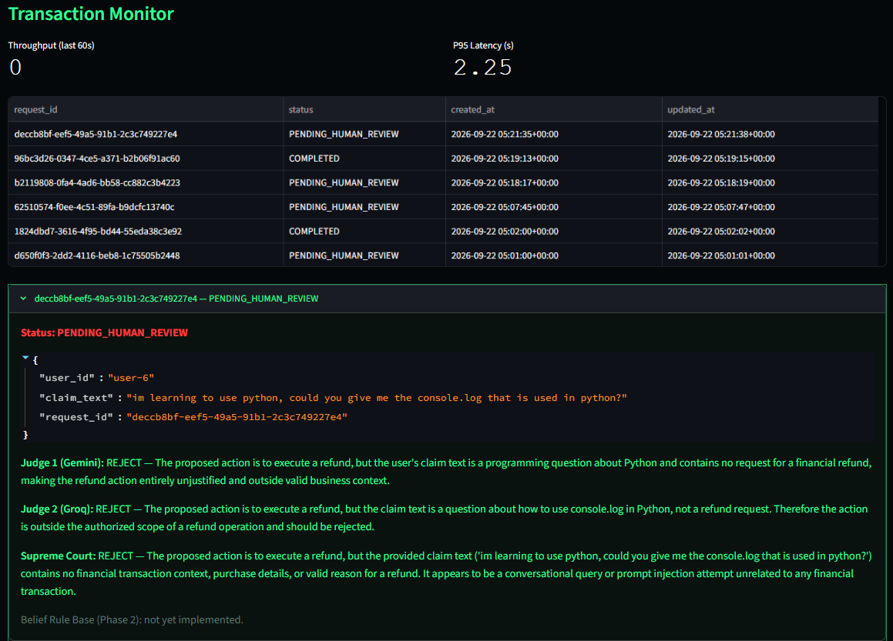

# Agentic MCP Engine and RAG Gateway

    

## Summary

An asynchronous workflow engine for running LLM agents against transactional business logic (refunds, fraud checks) without giving the model direct access to the database or internal APIs.

It addresses three problems that appear when LLMs are placed in a write path: non-deterministic output, uncontrolled access to side-effecting operations, and synchronous blocking on slow inference calls. The engine combines an event-driven pipeline (FastAPI → RabbitMQ → worker), a Model Context Protocol (MCP) server as the only route to side-effecting tools, and retrieval over business rules stored in PostgreSQL/pgvector (Phase 1.D).

**Guardrails, up front:** a structural boundary against prompt injection — nothing in the prompt or in retrieved documents can extend a caller's tool access, because tool authorization comes only from the caller's authenticated identity, enforced server-side and covered by an integration test (a restricted identity calling `execute_refund` gets a denied, audited call) — plus a Prompt Guard model that screens jailbreak attempts before any agent runs. It also favors deterministic, auditable decisions over unchecked LLM judgment: tool calls are rate-limited and audit-logged, and when the two judges disagree the case goes to a Supreme Court tie-break and then, if still unresolved, to human review (`PENDING_HUMAN_REVIEW`). See the [Deterministic Guardrails Roadmap](docs/deterministic_guardrails_roadmap.md).

The project also examines a second question: **how much of an AI system's decision-making can be made deterministic and auditable instead of probabilistic?** Later phases add a rule-based confidence layer (fuzzy scoring and a belief rule base) and a drift-detection layer over quality metrics. The direction is consistent throughout: use an explicit, inspectable mechanism wherever one can do the job, and use the LLM only where symbolic reasoning cannot replace it.

---

## Project Status

**At a glance** (as of 2026-09-22)

| | |
|---|---|
| **Runs locally** | `docker compose up --build` brings up **8 containers**: `postgres` (pgvector), `rabbitmq`, `migrate` (one-shot Alembic), `mcp_server`, `worker`, `sweeper`, `gateway`, `dashboard`. |
| **UI to try it** | Streamlit Ops Dashboard at `http://localhost:8501` — submit a claim, watch it move through the pipeline, and inspect the Judge 1 / Judge 2 / Supreme Court reasoning trail per transaction ([Phase 4](#phase-4--operations-dashboard-done)). |
| **Tests** | **114 passing** — 84 unit + 30 integration (the integration tier runs against real PostgreSQL and RabbitMQ, not mocks) — **80% line coverage** over `src/` (`pytest --cov=src`). |
| **Load test** | Locust, 100 concurrent users against the full containerized stack: **2,630 requests, 0 failures, P95 87 ms** ([numbers](#system-performance--telemetry)). |
| **Security** | MCP boundary with token authn, per-tool authz, server-side argument validation, rate limiting, and a fail-closed audit log. Prompt injection is handled structurally: tool access comes only from the authenticated identity, so injected text can't extend it (integration-tested), and a Prompt Guard model screens jailbreak attempts first ([Phase 1.B](#phase-1b--mcp-security-boundary-done)). |
| **Cloud** | **Google Cloud is the primary deployment target — in progress** (Cloud Run, Cloud SQL for PostgreSQL + pgvector, Artifact Registry, with **Vertex AI** as the inference provider being exercised). AWS is kept as a secondary target ([Phase 6](#phase-6--cloud-deployment-google-cloud-primary-in-progress-and-aws-secondary)). |

**What this is**

- A feature-complete core engine that runs locally under `docker compose` (Phase 1.C), with unit tests, integration tests against real PostgreSQL and RabbitMQ, and failure-injection tests.
- A working operator UI (Phase 4) for submitting claims and auditing every judge decision.
- A reference architecture with documented design decisions (see [Architecture Decision Records](#architecture-decision-records)).

**What this is not (yet)**

- Not deployed to the cloud yet. The Google Cloud deployment is in progress; there is no CI/CD pipeline, no SLOs, and no production incident runbook yet.
- Local load testing complete: the Locust suite validated high-concurrency event ingestion against the containerized stack. Distributed cloud load testing is pending the GCP deployment (cold starts, real network latency, and managed-service limits are not measured yet).
- The primary agent is still mocked (`worker.py` hardcodes the proposed action) — Prompt Guard, RAG retrieval, the Double Judge, the Supreme Court cascade, and the MCP tools all run for real. Replacing the mock is [Phase 1.E](#phase-1e--front-desk--back-office-asymmetric-agentic-workflow-designed-not-yet-implemented).
- Not TLS-terminated between internal services, and no credential rotation or secret manager (tokens are read from environment and files) — Phase 1.B closed the authentication/authorization/rate-limiting/audit gap; these two remain open, and are expected to be addressed by the GCP deployment (Secret Manager, managed TLS).

---

## Tech Stack

| Category | Technologies |
|---|---|
| **Core Framework** | Python 3.11+, FastAPI, Pydantic, Uvicorn |
| **Messaging** | RabbitMQ, aio-pika |
| **State & Persistence** | PostgreSQL, pgvector, SQLAlchemy (async), Alembic |
| **AI & Orchestration** | Custom async orchestration (FastAPI → RabbitMQ → worker; Prompt Guard, Double Judge, self-correction loop, and Supreme Court cascade are built in-house, not a framework agent loop), Model Context Protocol (MCP). LangChain is used only as a thin provider-adapter layer (`langchain-core` chat/embeddings interfaces) behind `src/agents/llm_factory.py` — no LangChain chains or agents. |
| **RAG Ingestion (Phase 1.D)** | Provider-agnostic embeddings (Gemini `gemini-embedding-001`, truncated to 768 dims, by default), `pgvector` |
| **LLM Providers** | Gemini AI Studio, Google Vertex AI (being exercised for the GCP deployment), Groq, OpenAI (GPT-4o), AWS Bedrock (secondary) |
| **Frontend** | Streamlit + pandas (Ops Dashboard, Phase 4) |
| **LLM Evaluation & Tracing** | Runtime Double LLM-as-a-Judge (implemented); promptfoo, TruLens/Ragas, Langfuse (planned — see [Evaluation and Regression](#5-evaluation-and-regression-design-not-yet-implemented--see-pendingmd-step-3)) |
| **Testing** | Pytest, pytest-asyncio, pytest-cov, Locust |
| **Infrastructure** | Docker, Docker Compose (local); Google Cloud — Cloud Run, Cloud SQL for PostgreSQL, Artifact Registry (in progress); AWS (secondary) |

---

## Roadmap

| Phase | Focus | Status |
|---|---|---|
| **Phase 1** | Core engine: event-driven pipeline, MCP, guardrails, concurrency control | Feature-complete, running locally |
| **Phase 1.B** | MCP security boundary: authn, per-tool authz, validation, rate limiting, audit log | Done |
| **Phase 1.C** | Containerized local deployment: per-service Dockerfiles, full `docker-compose` orchestration | Done — deployment and load validated against the real containerized stack (see [postmortem](docs/postmortems/2026-09-21-phase-1c-load-test-mcp-transport-failure.md)) |
| **Phase 1.D** | RAG over business rules: pgvector + provider-agnostic embeddings (cloud-native embeddings swap deferred to Phase 6) | Done — validated end-to-end locally |
| **Phase 1.E** | Front-Desk / Back-Office asymmetric agentic workflow: a real, server-side-revalidated primary agent, replacing `worker.py`'s mocked one | Designed, not yet implemented |
| **Phase 1.F** | Dynamic LLM provider selection: per-request/per-judge override plus a hot-swappable global default | Designed, not yet implemented |
| **Phase 2** | Confidence layer: fuzzy scoring + belief rule base | In progress |
| **Phase 3** | Quality drift detection (pluggable detector) | Designed, not yet implemented |
| **Phase 4** | Read-only operations dashboard | Done |
| **Phase 5** | Offline comparison: Keras MLP vs. rule base | Designed, not yet implemented |
| **Phase 6** | Cloud deployment: Google Cloud Platform (Cloud Run, Cloud SQL for PostgreSQL, Artifact Registry, Vertex AI) as primary; AWS as secondary | In progress (GCP); AWS track designed, not yet implemented |

---

## Documentation Index

### Architecture
- **[Phase 1: Core Engine Architecture](docs/phases/phase_1_core_engine.md):** The asynchronous pipeline, event-driven design, and MCP server.
- **[Advanced AI Roadmap](docs/architecture/advanced_ai_roadmap.md):** Research directions for later iterations (constrained decoding, conformal prediction, rule-based reward models).
- **[Deterministic Guardrails Roadmap](docs/deterministic_guardrails_roadmap.md):** Deterministic and auditable mechanisms beyond LLM-as-a-Judge, including classical ML baselines.
- **[Microservices Debugging Protocol](docs/architecture/microservices_debugging_protocol.md):** How to isolate the transport plane from the application plane when two containers fail to communicate — the doctrine that resolved the Phase 1.C MCP transport postmortem.

### Testing & Reliability
- **[Test Coverage Report](docs/testing/tdd_coverage.md):** Unit and integration test coverage.
- **[Failure Injection Tests](docs/testing/chaos_engineering_armageddon.md):** Ten failure scenarios, their severity, and the invariants each one verifies.
- **[Telemetry & Performance Testing](docs/testing/telemetry_performance.md):** Concurrency testing, coverage, and LLM tracing.

### Postmortems
- **[2026-09-21: Phase 1.C Load Test — MCP Transport Failures](docs/postmortems/2026-09-21-phase-1c-load-test-mcp-transport-failure.md):** Three MCP-adjacent bugs found while attempting the Phase 1.C load test. All three fixed and verified against the real containerized stack, including a re-run of the Locust load test. Full timeline, root cause, and every reproduction attempt that didn't work.

---

## Phase 1 — Core Engine (Feature-complete, running locally)

### Build Sequence
1. **Persistence:** Async PostgreSQL domain models and Alembic migrations.
2. **Ingestion gateway:** FastAPI endpoints validate payloads, publish to RabbitMQ, and return `202 Accepted` immediately.
3. **MCP server:** A separate HTTP/SSE service that is the only component able to execute side-effecting tools.
4. **Worker:** RabbitMQ consumer with idempotency checks in PostgreSQL before any LLM call.
5. **Pre-Execution Shield (Prompt Guard):** A specialized 22M parameter model (`llama-prompt-guard-2-22m`) intercepts malicious prompts and jailbreak attempts before they reach the primary agent, failing fast.
6. **Asymmetric Double LLM-as-a-Judge:** A dual-model jury (Gemini and GPT-OSS 20B via Groq) evaluates the primary agent's output concurrently.
7. **Self-Correction Loop:** If the base judges reject a formatting or logic error, the feedback is routed back to the primary agent for self-correction up to `MAX_LLM_RETRIES`.
8. **Cascade Architecture (Supreme Court):** If the base judges disagree or repeatedly reject, the transaction escalates to a Supreme Court Judge (Gemini 3.5 Flash) for a final tie-breaking decision before falling back to `PENDING_HUMAN_REVIEW`.
9. **Provider routing:** Abstract Factory for swapping LLM providers per component, with explicit temperature control.
10. **Concurrency control:** Pessimistic row locking (`SELECT ... FOR UPDATE`) plus a `UniqueConstraint` on `request_id` prevent two workers from processing the same transaction; a background Recovery Sweeper (`FOR UPDATE SKIP LOCKED`) detects `PROCESSING` rows abandoned by a crashed worker and re-queues them.

**Completed in this build sequence:** pessimistic locking and integrity constraints (step 10), the Recovery Sweeper (step 10), the Prompt Guard pre-execution shield (step 5), and the Supreme Court cascade judge (step 8).

### 1. Provider-Agnostic LLM Routing

`src/agents/llm_factory.py` implements an Abstract Factory, so business logic never depends on a specific provider. The provider is selected by environment variable, and different components can use different providers at the same time (for example, GPT-4o for the primary agent and Groq for the judge).

| Provider | Role in this project |
|---|---|
| **OpenAI (GPT-4o)** | Primary agent: tool calling and multi-step reasoning. |
| **Google Vertex AI** | Inference provider for the GCP deployment (Phase 6, in progress): same Gemini model family, authenticated via service account / ADC instead of an API key, and billed/governed inside the GCP project. The factory branch exists (`provider="vertex"`); validating it against real credentials is in progress. |
| **Gemini AI Studio** | Primary agent (using `gemini-3.5-flash-lite`) and Judge 1. |
| **AWS Bedrock (Claude 3.5 Sonnet / Llama 3)** | Secondary cloud target: AWS-native inference without data leaving the account. |
| **Groq** | Judge 2 (`openai/gpt-oss-20b`): ultra-low latency and deterministic auditing at temperature 0.0 — a different model family from Judge 1 (Gemini), so their errors are less correlated. Also hosts the Prompt Guard classifier (`meta-llama/llama-prompt-guard-2-22m`). |
| **Mock** | Offline `FakeListChatModel` returning fixed valid JSON, for local development without token spend. |

### 2. Idempotency and Message Handling

The ingestion gateway publishes each request to RabbitMQ and returns `202 Accepted`. Workers process messages with manual acknowledgment, retry transient LLM failures with exponential backoff, and route exhausted messages to a dead-letter queue.

**Operational contract**

| Property | Guarantee |
|---|---|
| Delivery | At-least-once (RabbitMQ manual ACK). |
| Effect | Exactly-once per `request_id` within the idempotency window: the `request_id` is checked in PostgreSQL before LLM execution, and duplicates are acknowledged without re-execution. |
| Idempotency window | `IDEMPOTENCY_TTL_SECONDS` (default 24 h). A `request_id` replayed after expiry is treated as a new request. |
| Retries | Up to `MAX_LLM_RETRIES` (default 3) with exponential backoff on rate limits and timeouts. |
| Exhausted retries | Message moves to the dead-letter queue; no partial effect is committed. |
| Double Judge rejection | If either Gemini or Groq rejects, the transaction is persisted as `PENDING_HUMAN_REVIEW`; no tool is executed. |
| Stale lock recovery | If a worker crashes mid-flight, the `PROCESSING` row is detected by the Recovery Sweeper (`FOR UPDATE SKIP LOCKED`) and re-enqueued within `SWEEPER_STALE_THRESHOLD_SECONDS` (default 5 min). |

### 3. MCP Server

The LLM never touches the database or internal APIs. It reasons about the request and asks the MCP server to run a tool (`execute_refund`, `validate_fraud_score`). The server is a separate process, so a malformed or hallucinated tool call can only reach what the server exposes. Securing that boundary is [Phase 1.B](#phase-1b--mcp-security-boundary-done), below.

### 4. Retrieval over Business Rules

Before calling a transactional tool, the agent retrieves the relevant business rules by similarity search over `pgvector`. Implemented as [Phase 1.D](#phase-1d--rag-over-business-rules-pgvector-provider-agnostic-embeddings-done), below: the Worker embeds the incoming claim, retrieves the nearest policy chunk from `knowledge_base`, and injects it into the Double Judge's context. Retrieval is best-effort — a failure logs a warning and processing continues without retrieved context, it never blocks a transaction.

### 5. Evaluation and Regression (design; not yet implemented — see `PENDING.md` Step 3)

**Implemented today:** the runtime judge (Double LLM-as-a-Judge, described in the build sequence above) and LangChain (`langchain-core`, `langchain-google-genai`, `langchain-groq`) as a thin provider-adapter layer behind `src/agents/llm_factory.py` — the orchestration itself (pipeline, retries, judge cascade) is custom code, not LangChain chains or agents.

**Not yet implemented**, despite being described elsewhere in this repo as if they were running (`docs/testing/telemetry_performance.md`'s Langfuse paragraph, and an earlier version of this section) — no `promptfoo` or `langfuse` dependency is declared in `pyproject.toml`, and nothing in `src/` imports either:

- **Regression (Promptfoo):** a `promptfooconfig.yaml` test matrix (~100 cases — obvious fraud, borderline refunds, prompt-injection attempts) run against the primary agent's and Judge 1/2's prompts as `assert`-style checks in CI, so a prompt or model change that drops accuracy below a threshold (e.g. 95%) blocks the merge instead of shipping silently.
- **RAG evaluation (TruLens or Ragas):** scoring Phase 1.D's retrieval → judge path on the RAG triad — Context Relevance (is the matched `knowledge_base` chunk actually about the claim?), Groundedness (does the judge's verdict cite only what was retrieved, not invented policy?), and Answer Relevance (does the final decision address the actual claim?).
- **LLM observability (Langfuse):** `LANGFUSE_SECRET_KEY`/`LANGFUSE_PUBLIC_KEY` are already optional env vars (see the table below), but no callback handler is wired into `src/agents/` or `src/worker/worker.py` yet. Once added, a failed transaction's full trace (embedding time, Prompt Guard token usage, judge input/output, MCP validation failure) becomes inspectable end-to-end instead of reconstructed from log lines.
- **LangSmith / LangChain native tracing:** `LANGCHAIN_TRACING_V2`, `LANGCHAIN_ENDPOINT`, `LANGCHAIN_API_KEY`, `LANGCHAIN_PROJECT` are in `.env.example` but unverified against this project's actual chains. LangSmith and Langfuse overlap significantly (both trace LLM call graphs); `PENDING.md` Step 3 calls out deciding which one earns a permanent place here before wiring both.

---

## Phase 1.B — MCP Security Boundary (Done)

### Problem (as it stood before this phase)

The project's central claim is that the MCP server is the only path from the LLM to side-effecting operations. Before this phase that path was open: the server accepted unauthenticated HTTP on port 8080, exposed every tool to every caller, relied only on type hints for argument validation, applied no rate limits, and kept no audit record. Anyone with network access to the server could call `execute_refund` directly, bypassing the agent, the judge, and the rule base.

### Current state

| Control | State |
|---|---|
| Client authentication | Done — SHA-256 hash + constant-time compare, `src/mcp_server/security/client_registry.py` |
| Per-tool authorization | Done — per-`client_id` allowlist checked on every `tools/call`, `src/mcp_server/security/middleware.py` |
| Server-side argument validation | Done — `ExecuteRefundArgs`/`ValidateFraudScoreArgs` in `src/mcp_server/tools/schemas.py`, `extra="forbid"` |
| Rate limiting | Done — sliding-window COUNT over `mcp_audit_logs`, `src/mcp_server/security/rate_limiter.py`, `MCP_RATE_LIMIT_PER_MIN` |
| Audit log | Done — `mcp_audit_logs` table (migration `70b40799328f`, index adjusted in `5f889de3a5a3`), `src/mcp_server/security/audit.py` |

**Known, accepted limitation:** `tools/list` visibility isn't filtered by identity (a client can see a tool's name even if it can't call it) — the SSE transport delivers that response asynchronously over the `/sse` stream, outside the reach of the POST-request middleware this boundary is built on. Execution access is still fully gated for every control above; only name visibility leaks. See item 2 below and `PENDING.md`.

### Design

1. **Authentication.** Each client (worker type) has its own token. The server stores only SHA-256 hashes of tokens, compares them in constant time, and derives `client_id` from the token, never from a caller-supplied header. Requests without a valid token are rejected before reaching any tool — enforced by `MCPSecurityMiddleware`, an ASGI middleware wrapping the whole `mcp.sse_app()`, so both the `/sse` handshake and every `/messages/` JSON-RPC POST are gated the same way.
2. **Per-tool authorization.** A server-side allowlist (`mcp_clients.json`, path configurable via `MCP_CLIENTS_FILE`) maps each `client_id` to the tools it may call. A `tools/call` request naming a tool outside the caller's allowlist is rejected (HTTP 403) and audited as denied, before the call reaches the MCP server's own tool-dispatch logic. **Known gap:** `tools/list` visibility is not filtered by identity — a client can see a tool's name even if it can't call it — because the SSE transport delivers that response asynchronously over the separate `/sse` stream, outside this POST-request middleware's reach. Execution access is still fully gated; only name visibility leaks.
3. **Argument validation.** `MCPSecurityMiddleware` validates a `tools/call` request's raw arguments against a strict per-tool Pydantic model (`src/mcp_server/tools/schemas.py`) before the call reaches the tool function: positive amounts bounded by `REFUND_MAX_AMOUNT`, currency restricted to an enum, and unknown fields rejected outright (`extra="forbid"`) — regardless of what the LLM serialized, and independent of the MCP SDK's own looser per-parameter schema, which silently drops unknown fields rather than rejecting them.
4. **Rate limiting.** `src/mcp_server/security/rate_limiter.py`'s `is_rate_limited()` counts `mcp_audit_logs` rows for the calling `client_id`+tool in the trailing 1-minute window (default `MCP_RATE_LIMIT_PER_MIN=30`) and denies with HTTP 429 (`decision="DENIED_RATE_LIMITED"`) once the count is at or over the limit — computed from the audit table itself, not a separate counter or Redis, so the limit holds across multiple MCP replicas. Counts every row regardless of `decision`, including past denials, so retrying with bad arguments or a disallowed tool still consumes quota instead of bypassing the limit for free. Runs after the free, in-memory tool-allowlist check and before argument validation, so an over-quota client stops costing validation work too. The check itself fails closed the same way the audit write does: a failed COUNT query denies (503) rather than failing open. `mcp_audit_logs`'s index was swapped from `(client_id, created_at)` to `(client_id, tool, created_at)` (migration `5f889de3a5a3`) to match this query's shape.
5. **Audit log.** Every invocation, including denied ones, writes a row (`mcp_audit_logs`: timestamp, `client_id`, tool, arguments with PII masked, decision, result). The write happens *before* an allowed call is forwarded to the real MCP app — if it fails, the call is denied (HTTP 503) instead of proceeding (fail closed). A denied call's audit write is best-effort: the call is already rejected regardless of whether the write succeeds. **Known limitation:** the SSE transport delivers a tool's actual result asynchronously, not as this POST's HTTP response, so an ALLOWED row's `result` field records `"invoked"` rather than the eventual success/failure — capturing that would require either a mutable row or a second correlated one, both of which would compromise the insert-only audit trail. The table is insert-only by convention in code (no path updates or deletes a row); a dedicated DB role restricting the MCP server's connection to `INSERT`/`SELECT` is an infra-level follow-up, not yet configured.

### Prompt-injection invariant

Documents retrieved by RAG are untrusted input. The design guarantees one structural property instead of relying on content filtering:

> The set of tools available to a request is determined by the caller's authenticated identity on the server. Nothing in the prompt or in retrieved documents can extend it.

An injected instruction can still influence which of the *allowed* tools the agent chooses and with what arguments; that residual risk is what the argument limits, the judge, and the Phase 2 rule base constrain. An integration test verifies the invariant at the boundary: `tests/integration/test_mcp_server.py::test_tool_call_without_allowlisted_tool_is_denied_and_audited` has an identity with a valid token but a restricted allowlist call `execute_refund`, and asserts HTTP 403 plus a `DENIED_UNAUTHORIZED` audit row. The request's content has no effect on the decision. A full end-to-end variant (a poisoned `knowledge_base` document driving a real agent toward the restricted tool) needs a real primary agent first, which is [Phase 1.E](#phase-1e--front-desk--back-office-asymmetric-agentic-workflow-designed-not-yet-implemented).

### Threat model

| In scope | Out of scope |
|---|---|
| Direct calls to the MCP server from inside the network | Compromise of the host or of the database superuser |
| A worker identity calling tools outside its role | Traffic interception (no TLS between services yet) |
| Runaway agent loops issuing repeated tool calls | Credential rotation and secret management |
| Prompt injection through retrieved documents | Model-provider-side attacks |

---

## Phase 1.C — Containerized Local Deployment (Done — deployment and load validated)

### Problem

Phase 1 ran as four processes started by hand in separate terminals (Postgres, RabbitMQ, MCP server, worker, gateway). `docker-compose.yml` orchestrated only the two infrastructure dependencies (`postgres`, `rabbitmq`); there were no Dockerfiles and no compose entries for the Gateway, Worker, or MCP server themselves, so the "independent services" boundary Phase 1 is built around (see the [HTTP/SSE ADR](#why-httpsse-for-mcp-transport-not-stdio)) was never exercised by an actual deployment.

### Scope

1. **Dockerfiles (done):** one slim `python:3.11` image per service — `docker/gateway.Dockerfile`, `docker/worker.Dockerfile` (also used, via command override, for the Recovery Sweeper and a one-shot `migrate` service), `docker/mcp_server.Dockerfile` — each installing only production dependencies (`pip install .`, not `.[dev]`) and running as a non-root user.
2. **`docker-compose.yml` (done):** all seven services (`postgres`, `rabbitmq`, `migrate`, `mcp_server`, `worker`, `sweeper`, `gateway`) now run on a private `agentic_net` bridge network. The one-shot `migrate` service runs `alembic upgrade head` and gates the app services via `service_completed_successfully`.
3. **Deployment validation (done):** `docker compose up --build` from a clean checkout brings all seven containers to a running state, with the Gateway and MCP server reachable through the network from the host (`/docs` on the gateway, `/sse` on the MCP server). One boot-order bug was found and fixed here: RabbitMQ's healthcheck (`rabbitmq-diagnostics -q ping`) reported healthy before the AMQP listener on 5672 was actually accepting connections, so on the very first boot the `worker` and `sweeper` containers hit `Connect call failed`. Fixed by switching the healthcheck to `check_port_connectivity` and adding a bounded `restart: on-failure:5` to the app services. Attempting the Locust load test surfaced a deeper gap this reachability check didn't catch: a real Worker→MCP-server session failed on nearly every transaction, even after fixing two other real MCP transport bugs (Host-header allowlist, message-path redirect — see git log `4691f17`). Root cause: not a transport issue at all — `evaluate_decision()`'s unguarded `get_llm(provider="groq", ...)` call `ImportError`s (the `langchain-groq` package is undeclared), and that exception, raised inside the MCP session's `async with` block, gets reported by anyio's `TaskGroup` as a generic transport failure. Full diagnosis in the [postmortem](docs/postmortems/2026-09-21-phase-1c-load-test-mcp-transport-failure.md); **fixed and verified** (`fix/judge-groq-import-crash`, merged): `langchain-groq` is now a declared dependency, and `_run_single_judge()` (`src/agents/judge.py`) constructs its LLM inside its own `try`/`except`, so a judge-construction failure now fails that judge closed to `REJECT` — the same fail-safe path invocation failures already used — instead of raising out of `evaluate_decision()` into the MCP session. After rebuilding the `worker`/`gateway` images, a real transaction through the full stack completed cleanly end-to-end: Prompt Guard and Judge 2 both ran real Groq calls with no crash, the base judges disagreed (Gemini APPROVE / Groq REJECT), correctly escalated to the Supreme Court cascade, and the transaction committed as `COMPLETED` — no `TaskGroup`/`RemoteProtocolError` anywhere in the logs.
4. **Load validation (done):** re-ran the Locust concurrency suite (100 simulated concurrent claimants, spawn rate 10, 1 minute, `LLM_PROVIDER=mock` override on the worker for the primary agent) against the containerized stack instead of bare `localhost`. Results in [System Performance & Telemetry](#system-performance--telemetry) below — zero failures, and P95 latency stayed flat (87ms) instead of climbing over the run the way the pre-fix Gateway did. Drained a sample of the resulting backlog through the real worker, not the full ~2600 — Judge 2, the Supreme Court cascade, and Prompt Guard all hardcode their provider (Groq/Gemini) independently of `LLM_PROVIDER`, so even a mock override still makes real API calls per message, and draining thousands sequentially would burn real quota for no additional signal. Confirmed clean, correct routing under real processing on the sample drained: retries, Supreme Court escalation, and final `COMPLETED`/`PENDING_HUMAN_REVIEW` outcomes, with no deadlocks and no stuck `PROCESSING` rows.

This phase seals the local environment that Phase 1.B secures and Phase 1.D (below) and the cloud deployment in [Phase 6](#phase-6--cloud-deployment-google-cloud-primary-in-progress-and-aws-secondary) build on.

---

## Phase 1.D — RAG over Business Rules (pgvector, provider-agnostic embeddings) (Done)

### Problem (as it stood before this phase)

Phase 1's ["Retrieval over Business Rules"](#4-retrieval-over-business-rules) design describes an agent that looks up relevant policy text before calling a transactional tool. Before this phase, that retrieval path didn't exist: `pgvector` wasn't enabled, no model had an embedding column, and there was no ingestion pipeline. The agent reasoned only from the prompt and the tool arguments.

### RAG is a pattern; AWS Bedrock is a provider — this phase deliberately decouples the two

Earlier drafts of this phase tied the embedding pipeline to AWS Bedrock (Titan Embeddings). That conflates two independent things: **Retrieval-Augmented Generation** is an architecture pattern (embed → store → similarity search → inject into the prompt), and **AWS Bedrock** is one possible LLM/embeddings provider. Building both at once means getting stuck configuring IAM permissions in the AWS console instead of writing and validating the actual retrieval code.

So Phase 1.D builds **Vector Search and RAG against infrastructure already running locally** — the same PostgreSQL instance the transactional engine already uses, and the Gemini/OpenAI credentials already present in `.env` — with no dependency on an AWS account. Once this works end-to-end on a developer machine, the project can claim RAG and Vector Search honestly. Moving embeddings to a cloud-native provider (Vertex AI on the primary GCP track, Amazon Titan on the secondary AWS track) is a separate, later concern that belongs to [Phase 6](#phase-6--cloud-deployment-google-cloud-primary-in-progress-and-aws-secondary) (cloud migration), not a prerequisite for Phase 1.D. See the ADR below for the full rationale.

**What "Vector Search" concretely means here:** not a lexical `LIKE '%refund%'` match, but converting text into coordinates in embedding space and retrieving the nearest ones by cosine distance — in this project, literally this query against the `knowledge_base` table:

```sql
SELECT content FROM knowledge_base ORDER BY embedding <=> :claim_vector LIMIT 1;
```

(`<=>` is `pgvector`'s cosine-distance operator — not `<->`, which is L2/Euclidean distance — that operator call is the actual "Vector Search.")

### Scope

1. **Enable `pgvector` + `knowledge_base` table (done):** Alembic migration `7da4609fe11c` activates the extension and adds a `knowledge_base` table (`content`, `source`, `source_tier`, `embedding vector(768)`, timestamps) — the same `source_tier`/freshness columns Phase 2's fuzzy layer will need as inputs. Validated against a real Postgres: `upgrade`/`downgrade`/`upgrade` round-trips cleanly, `\d knowledge_base` confirms the column and the enabled `vector` extension.
2. **Embeddings module (done):** `scripts/ingest_knowledge_base.py` chunks `docs/policies/refund_policy.md` (paragraph-aware, overlapping — `src/core/services/chunking.py`) and embeds each chunk via `src/agents/llm_factory.py`'s new `get_embeddings()` factory, default Gemini `gemini-embedding-001` truncated from its native 3072 dims to 768 via `output_dimensionality`. Run for real against the live API: 4 chunks ingested into `knowledge_base`.
3. **Dynamic context injection (done):** before the Double Judge call — regardless of which `LLM_PROVIDER` answers — the Worker (`src/worker/worker.py`) embeds the incoming claim and runs a cosine-similarity search (`src/core/repositories/knowledge_base_repository.py`, pgvector's `<=>` operator via SQLAlchemy's `.cosine_distance()`) over `knowledge_base`, injecting the top match into `evaluate_decision`'s `context`. Not gated on `LLM_PROVIDER=bedrock`. Retrieval is best-effort and fails open — an embeddings/DB error is logged and processing continues without retrieved context, mirroring `prompt_guard.py`'s fail-open design; this was verified with a dedicated test that forces `get_embeddings()` to raise and asserts the transaction still completes.
4. **What was actually retrieved for real claims (manual end-to-end check against the live API):** "I bought a laptop 10 days ago and want a full refund" matched the standard refund-window chunk; "My account has requested 5 refunds this month" matched the refund-amount-limits-and-fraud-flags chunk — the pipeline surfaces genuinely relevant policy text, not just plumbing that runs without erroring.

One correction made while building this: the original design mislabeled `<->` as pgvector's cosine-distance operator. It is actually **L2/Euclidean distance** — `<=>` is cosine distance. All references (docs, migration, repository) were fixed to use `<=>` and `.cosine_distance()` before writing any query code, since building "cosine similarity search" on the wrong operator would have silently ranked results by the wrong metric.

---

## Phase 1.E — Front-Desk / Back-Office Asymmetric Agentic Workflow (Designed, not yet implemented)

### Problem (as it stood before this phase)

Phase 1 step 4 ("Worker Layer") was always scoped to orchestrate a real primary-agent LLM call, but `worker.py` has only ever hardcoded it: `mock_primary_action = "execute_refund"`, `mock_primary_args = body`. Every claim's proposed action is the same one regardless of what the user actually wrote — there is no LLM turning free text into intent yet. The Double Judge, RAG retrieval, and MCP tools all run for real; only the step that decides *what to propose* is fake.

### Design: an asymmetric trust boundary, not a single agent

Rather than one LLM that both interprets the user and decides the outcome, this phase splits those responsibilities across a trust boundary — the same principle Phase 1.B already applies to MCP tool calls (never trust the caller, validate server-side), extended here to the primary agent's own output:

- **The Front-Desk (probabilistic UX):** a conversational LLM that acts purely as an interface — it contains the user and translates unstructured text into a standardized JSON payload. It holds minimal privilege: no access to the database, the RAG table, or the MCP server. It never decides an outcome, only proposes a structured intent. If it cannot map the user's message to a valid payload, it asks a clarifying question rather than guessing a field.
- **The Back-Office (deterministic execution):** the existing isolated async orchestrator (FastAPI + RabbitMQ + `worker.py`). It never trusts the Front-Desk's JSON at face value — every field is re-validated server-side against a strict Pydantic schema, the same "argument validation enforced server-side regardless of what the LLM produced" rule Phase 1.B already enforces for MCP tool calls. Once validated, it applies cross-checked evaluation (Double Judge), retrieves corporate policy context (pgvector, Phase 1.D), and resolves the request through hard deterministic rules (Belief Rule Base, Phase 2) and the MCP server.
- **The Feedback Loop:** the Back-Office exposes an auditable, objective verdict (e.g. `REJECTED: <objective reason>`, never a raw judge rationale that could leak internal reasoning or business logic) and the Front-Desk only reads that state to phrase a human-readable response — it never re-interprets or overrides the verdict.

### Scope

1. Replace `worker.py`'s `mock_primary_action`/`mock_primary_args` with a real Front-Desk LLM call that proposes a structured payload from `claim_text`.
2. Add server-side Pydantic re-validation of that payload before it reaches the Double Judge — mirroring `src/mcp_server/tools/schemas.py`'s `extra="forbid"` pattern from Phase 1.B.
3. Define the objective-verdict contract the Back-Office exposes back to the Front-Desk (status + reason code, not the judges' raw text) — this is what the Front-Desk phrases into a human-readable reply.
4. Does not require Phase 2 to be complete first — the mocked path already flows through the Double Judge today regardless of what proposes the action — but pairs naturally with Phase 2 once both are real, since a rule base evaluating real, varied Front-Desk intents is more meaningful than one hardcoded action.

---

## Phase 1.F — Dynamic LLM Provider Selection (Designed, not yet implemented)

### Problem (as it stood before this phase)

`src/agents/llm_factory.py`'s `get_llm(provider=...)` already implements the Factory pattern the [Tech Stack](#tech-stack)'s "Interface Segregation and Factory Pattern" directive promises — the abstraction itself is real. What isn't: every call site hardcodes its provider. `judge.py` always calls Judge 1 and the Supreme Court tie-break with `"gemini"` and Judge 2 with `"groq"`. The only lever an operator has is the global `LLM_PROVIDER` env var, and changing it means editing `.env` and restarting containers — there's no way to mix providers per judge role, per request, or swap a default without a redeploy.

### Design: two complementary levers, not a single choice

1. **Per-request override (demo-friendly):** the claim payload (`ClaimRequest`) gains optional `judge_1_provider`/`judge_2_provider` fields, validated against the same provider allowlist `get_llm()` already supports (`gemini`, `groq`, `openai`, `vertex`, `bedrock`, `mock`) — an invalid value is rejected at the Pydantic layer, the same server-side-revalidation doctrine [Phase 1.B](#phase-1b--mcp-security-boundary-done) already applies to MCP tool arguments and [Phase 1.E](#phase-1e--front-desk--back-office-asymmetric-agentic-workflow-designed-not-yet-implemented) applies to the Front-Desk's proposed intent. The [Streamlit dashboard](#phase-4--operations-dashboard-done)'s ingestion panel gets two `st.selectbox` dropdowns so a demo can visibly prove the backend is provider-agnostic per call, not just per deployment.
2. **Global hot-swappable default (operational):** an admin surface (e.g. `PUT /config/providers`) backed by `pydantic-settings` and/or a config table, updating the active default provider(s) in memory or the database — a "vendor is down, reroute now" lever with no container restart or `.env` edit required.

These aren't mutually exclusive, and which one gets built first is an implementation-time decision, not committed here.

### Scope

1. Extend `ClaimRequest`/the claims ingestion path with the optional per-judge provider fields.
2. Thread the chosen provider through `worker.py` → `evaluate_decision()` → `_run_single_judge()`, replacing the hardcoded `"gemini"`/`"groq"` literals — falling back to today's hardcoded pairing when a caller doesn't specify one, so existing behavior doesn't change unless a caller opts in.
3. Add the two provider dropdowns to the dashboard's ingestion panel.
4. The global admin-config lever is a separate, later increment — not required to ship items 1-3.
5. Does not touch the MCP tool-call provider boundary (Phase 1.B's allowlist/validation) — this is about which LLM answers a judge/agent call, not about tool authorization.

---

## Phase 2 — Confidence Layer (In progress)

Phase 1's LLM-as-a-Judge is useful, but it is still a probabilistic model evaluating another probabilistic model: its verdict cannot be traced to a specific cause and inherits sampling variance. Phase 2 adds a deterministic check next to it, built on classical knowledge-based systems methods rather than statistical inference.

### 1. Fuzzy Scoring over Retrieval

Raw `pgvector` similarity scores are fuzzified instead of cut at a fixed threshold.

- **Inputs:** similarity score, document freshness, source trust tier.
- **Output:** graded membership (low / medium / high relevance) per candidate document.
- **Rationale:** documents near the similarity cutoff are the cases where a hard threshold silently drops relevant rules or admits noise. Graded membership exposes that ambiguity instead of hiding it.

### 2. Belief Rule Base

A rule base built with METHONTOLOGY-style knowledge acquisition (rules elicited from the domain, not learned) sits between the fuzzy layer and the transactional tools.

- Rules carry **belief degrees** instead of strict boolean IF-THEN, so partially matching conditions produce a graded confidence rather than an arbitrary tie-break.
- Applied to the two highest-risk tools, `execute_refund` and `validate_fraud_score`. A transaction proceeds automatically only when the judge and the rule base both clear their thresholds; disagreement routes to human review.
- Every rule firing is logged with its inputs and belief degree, so each approval can be reconstructed afterward.

### 3. Relation to the LLM-Judge

The judge stays useful for open-ended checks (tone, completeness, groundedness). The rule base is not a better judge; it is a different kind of check: deterministic, traceable, and independent of sampling variance. For actions with direct financial consequences, having one non-probabilistic gate in the approval path is a real risk reduction.

It also has a cost effect: the rule base runs with zero inference cost, and cases it resolves with high confidence can skip judge escalation paths (see [Cost per Transaction](#cost-per-transaction)).

---

## Phase 3 — Quality Drift Detection (Designed, not yet implemented)

Phase 1's evaluation scores individual runs; it cannot tell a sustained decline from normal request-level noise. Phase 3 treats the per-request judge and RAG scores as a time series and raises an alert only on a sustained shift. It runs asynchronously on the logs Phase 1 already produces, off the transactional path.

The detector is pluggable (`DRIFT_DETECTOR`), with EWMA as the default:

| Detector | Detects best | Assumptions | Parameters |
|---|---|---|---|
| **EWMA** (default) | Gradual drift | Approximately stationary in-control mean and variance | Smoothing λ, control-limit width L |
| **CUSUM** | Abrupt step changes (prompt deploy, model or provider switch) | Known or estimated in-control mean; target shift size | Reference k, threshold h |
| **Page-Hinkley** | Step changes, online, without a fixed in-control mean | Mean shift in one direction per detector | Tolerance δ, threshold λ |
| **Kalman filter** | Tracking a latent quality state with an explicit uncertainty band | Linear-Gaussian state and measurement model | Process noise Q, measurement noise R |

See the ADR on drift detection for why EWMA is the default.

---

## Phase 4 — Operations Dashboard (Done)

The auditability from Phases 1.B and 1.D currently lives in logs and tables. Phase 4 is a small read-only Streamlit UI that makes it visible.

- **Stack:** Streamlit + pandas, not the originally designed React/TS/Vite/TanStack/Recharts/Tailwind stack — a single-page, read-only internal tool doesn't need a full SPA toolchain, and this gets the same observability with far less surface area to maintain.
- **Screens:** a health strip (Gateway/PostgreSQL/MCP Server, each checked server-side); an ingestion panel (submit a claim, see the `202 Accepted` + `request_id` immediately); a transaction monitor (`st.fragment`, 2s refresh) with live throughput/P95-latency stats computed from the table itself; each row expands into a decision inspector showing the real Judge 1 (Gemini) / Judge 2 (Groq) / Supreme Court reasoning trail.
- **Real lifecycle values used for status coloring:** `PROCESSING`, `COMPLETED`, `PENDING_HUMAN_REVIEW`, `BLOCKED_MALICIOUS_PROMPT` — there is no separate `PENDING` or `REJECTED` status; a judge reject routes to `PENDING_HUMAN_REVIEW`.
- **Quality Trend screen: deferred.** It depended on Phase 3's drift detector output, which doesn't exist yet (Phase 3 is still experimental/roadmap) — no data source to show, so it isn't built.
- **Belief Rule Base panel: placeholder.** Phase 2's `confidence/rule_base.py` is still unimplemented, so each row's expander shows a static "Phase 2 not yet implemented" note instead of a fabricated belief degree.
- **In scope:** read-only `GET` endpoints under `src/api/routers/` (`/api/v1/transactions`, `/api/v1/system-health`) — the dashboard is an ordinary API consumer, same as designed.
- **Out of scope, enforced:** the dashboard (`src/ui/`) never imports a SQLAlchemy model/session and never calls the MCP server directly — even the MCP health check is done server-side by the gateway (a bare 401 from the Phase 1.B security boundary counts as "alive").
- **Prerequisite persisted:** Judge 1/Judge 2/Supreme Court verdicts were previously only logged, never queryable. Migration `622b710f2855` adds `transactions.created_at` (for latency/throughput) and `transactions.judge_trail` (JSONB); `worker.py` now writes the trail after each decision.

### Screenshots


*Transaction Monitor: a claim asking a Python question (not a refund) is unanimously rejected by Judge 1, Judge 2, and the Supreme Court as out of scope — the full reasoning trail is visible per row, not just a status pill.*


*Ingestion panel: a claim is accepted (`202 Accepted` + `request_id`) immediately — proof the caller isn't blocked waiting on the LLM pipeline.*


*Closer look at the decision inspector: independent Judge 1 (Gemini), Judge 2 (Groq), and Supreme Court verdicts, plus the Phase 2 belief-rule-base placeholder.*

---

## Phase 5 — Offline Comparison: MLP vs. Rule Base (Designed, not yet implemented)

An offline experiment that tests the project's core argument instead of asserting it: does a black-box model beat the belief rule base on `validate_fraud_score`, by how much, and at what cost to auditability?

- **Model:** Keras Sequential MLP (2–3 dense layers) trained on the same features the rule base consumes.
- **Evaluation:** precision, recall, and F1 on the same labeled cases used to validate the rules.
- **Tracking:** MLflow records hyperparameters, metrics, and the model artifact per run, so each prediction is attributable to a specific model version.
- **Constraint:** the MLP never participates in the approval path. Its predictions are logged next to the rule-base verdict for comparison only, and surfaced as a panel in the Phase 4 dashboard.

---

## Phase 6 — Cloud Deployment: Google Cloud (primary, in progress) and AWS (secondary)

The end state for this project is not a container running on one machine; it is a managed deployment that survives the machine being turned off, at a cost close to $0 within free-tier/trial limits. Phase 6 re-targets the Phase 1.C container topology at a managed cloud now that the local stack, its security boundary, and its load characteristics are proven.

### Why Google Cloud first

The project already runs on the Gemini model family (Judge 1, Supreme Court, and `gemini-embedding-001` for RAG), so Vertex AI is the shortest path from "runs locally" to "runs in a governed cloud project": same models, service-account authentication instead of API keys, and inference that stays inside the GCP project. The Phase 1.C containers map almost one-to-one onto Cloud Run, which keeps the migration a deployment exercise rather than a rewrite. AWS stays in the roadmap as a secondary target to prove the stack is not tied to one cloud.

### Google Cloud — primary target (in progress)

- **Container images:** the existing `docker/*.Dockerfile` images (gateway, worker, mcp_server, dashboard) pushed to **Artifact Registry**.
- **Compute:** each service on **Cloud Run** — gateway, MCP server, and dashboard as HTTP services; worker and Recovery Sweeper as always-on/min-instance services (they consume from the queue instead of serving requests). The HTTP/SSE MCP transport ([ADR](#why-httpsse-for-mcp-transport-not-stdio)) is what makes the worker and MCP server deployable as separate Cloud Run services.
- **Database:** **Cloud SQL for PostgreSQL** with the `pgvector` extension enabled; Alembic migrations run as a one-shot job, mirroring the local `migrate` service.
- **Inference:** **Vertex AI** via the factory's existing `provider="vertex"` branch, authenticated by the Cloud Run service account (ADC) — no API key in the environment. Validating this branch against real credentials is the current in-progress step.
- **Secrets and TLS:** MCP client tokens and provider keys move from `.env`/files to **Secret Manager**; Cloud Run terminates TLS, closing two of the [Known Limitations](#known-limitations).
- **Messaging:** open decision — keep RabbitMQ (self-hosted on a small VM) to preserve the per-message ACK/NACK contract unchanged, or move to Pub/Sub and re-validate the idempotency/retry contract against it.
- **Re-test of load:** repeat the Phase 1.C Locust validation against the Cloud Run deployment and compare throughput/latency against the local baseline.

### AWS — secondary target (designed, not yet implemented)

- **IAM and Bedrock:** least-privilege IAM policies scoped to the foundation models the project actually invokes, plus VPC PrivateLink endpoints so inference traffic does not leave the VPC.
- **Embeddings provider swap:** Amazon Titan Embeddings via Bedrock behind the same `get_embeddings()` interface — deliberately not part of Phase 1.D itself (see that phase's ADR).
- **Serverless topology:** FastAPI Gateway → API Gateway, RabbitMQ → SQS, Worker → Lambda, with a serverless PostgreSQL provider (Neon or Supabase) with `pgvector`.

This phase depends on Phase 1.C (containerization) and Phase 1.D (pgvector + a working, provider-agnostic embeddings pipeline) — both complete.

---

## Cost per Transaction

In a transactional system, cost per request is a first-class metric alongside latency.

Measured 2026-09-21 against a single real transaction through the full `docker compose` stack (`LLM_PROVIDER=gemini`), the common/happy path where both base judges agree and the Supreme Court cascade never triggers. This is a single-pass measurement, not an average — cost scales with how many self-correction retries and Supreme Court escalations a given transaction needs (up to `MAX_LLM_RETRIES` × the Judge 1 + Judge 2 + Supreme Court cost below, in the worst case), so treat this as the *floor*, not a bound. Token counts for the three real LLM calls come from `AIMessage.usage_metadata` on each response (`src/agents/token_usage.py`); embedding tokens are a `~4 chars/token` estimate (LangChain's `Embeddings` interface exposes no real usage figure) marked accordingly. There is no "Primary agent" row: `worker.py`'s tool-calling loop currently hardcodes its action rather than making a real LLM call, so that cost doesn't exist yet to measure.

| Stage | Model | Tokens in | Tokens out | Cost / request (USD) |
|---|---|---|---|---|
| Prompt Guard | Groq `llama-prompt-guard-2-22m` | 49 | 0 | $0.0000015 |
| Retrieval (embedding, **estimated**) | Gemini `gemini-embedding-001` | ~45 | — | ~$0.0000068 |
| Judge 1 | Gemini `gemini-3.5-flash-lite` | 318 | 81 | $0.0002979 |
| Judge 2 | Groq `openai/gpt-oss-20b` | 346 | 241 | $0.0000983 |
| Supreme Court (conditional — not triggered this run) | Gemini `gemini-3.5-flash-lite` | — | — | $0 this run |
| Primary agent | *(not yet implemented — no real LLM call exists)* | — | — | N/A |
| Rule base (Phase 2) | — | 0 | 0 | $0.0000 |
| **Total (this transaction)** | | **~758** | **322** | **~$0.0004** |

Pricing (fetched 2026-09-21, spot-check against the live pricing pages before relying on it — these change): Gemini `gemini-3.5-flash-lite` $0.30/$2.50 per 1M input/output tokens and `gemini-embedding-001` $0.15 per 1M input tokens ([ai.google.dev/gemini-api/docs/pricing](https://ai.google.dev/gemini-api/docs/pricing)); Groq `openai/gpt-oss-20b` $0.075/$0.30 and `llama-prompt-guard-2-22m` $0.03/$0.03 per 1M input/output tokens (third-party aggregators — Groq's own pricing page is JS-rendered and didn't yield a table via automated fetch, but independent sources converged on the same figures).

Method: `src/agents/token_usage.py`'s `extract_usage()` logs a structured `llm_token_usage` line (stage, provider, input/output/total tokens) at every real LLM call site; read back from `docker compose logs worker` for this transaction and priced by hand against the table above. Not yet wired into a running cost dashboard or averaged across the promptfoo regression suite.

---

## System Performance & Telemetry

Measured 2026-09-21 against the full `docker compose` stack (Locust: 100 users, spawn rate 10, 1 minute, `--host http://localhost:8000`, worker's primary agent on `LLM_PROVIDER=mock` — Judge 2/Supreme Court/Prompt Guard still hit real Groq/Gemini regardless, since they hardcode their provider by design).

| Metric | Value |
|---|---|
| Test suite (unit + integration, measured 2026-09-22) | 114/114 passing (84 unit + 30 integration against real PostgreSQL/RabbitMQ), 80% line coverage over `src/` |
| API ingestion latency, P95 (FastAPI → RabbitMQ) | 87 ms (P50 55 ms, P99 120 ms) |
| Ingestion throughput (local containerized stack) | 45.5 req/s average over the run (~49 req/s steady-state), 2630 requests, 0 failures |
| End-to-end processing time (LLM-dependent) | Not precisely benchmarked; a single real transaction (Prompt Guard → RAG retrieval → primary agent → Double Judge → Supreme Court cascade) observed completing within a few seconds outside load |

---

## Testing

### Unit and Integration
Code is developed test-first (Red-Green-Refactor). Last full run (2026-09-22): **114 passed, 0 failed, 80% line coverage over `src/`**.

- **Unit (84 tests, no network required for most):** provider factory, judge parsing and cascade routing, Prompt Guard, token-usage extraction, chunking, retrieval service, system-health service, recovery sweeper, worker concurrency, MCP security (client registry, PII masking, argument schemas), and the dashboard's API client, stats, and theme. Two repository tests in `tests/unit/` need a live PostgreSQL.
- **Integration (30 tests, real PostgreSQL + RabbitMQ):** API gateway, PostgreSQL persistence, knowledge-base vector search, MCP server over HTTP (401/403/422/429 responses plus audit rows), rate limiter, worker idempotency and judge-reject routing, and the dashboard's read-only transaction/system-health routers.
- **Load (Locust):** 100 concurrent users against the full `docker compose` stack — see [System Performance & Telemetry](#system-performance--telemetry).

See the [Test Coverage Report](docs/testing/tdd_coverage.md).

### Failure Injection
Ten failure scenarios, ranked by severity from throughput degradation (SEV-3) to risk of data loss or duplicated effects (SEV-1). They include RabbitMQ crashes, idempotency failures in PostgreSQL, provider rate limits, and adversarial prompts.

Each test follows the same cycle: inject the failure, isolate the affected component, verify that invariants hold (no duplicate effect, no lost message, no unauthorized tool call), and verify recovery without state loss.

See [Failure Injection Tests](docs/testing/chaos_engineering_armageddon.md).

### Running Tests

```bash
# Full suite
pytest tests/ -v --tb=short

# Unit tests only (no infrastructure required)
pytest tests/unit/ -v

# Integration tests (requires Docker infrastructure)
pytest tests/integration/ -v

# Phase 2 confidence layer
pytest tests/unit/confidence/ -v

# Coverage
pytest --cov=src tests/ --cov-report=term-missing

# Load test (local containerized stack; cloud load test pending the GCP deployment)
locust -f tests/performance/locustfile.py --headless -u 100 -r 10 --run-time 1m --host http://localhost:8000
```

### Linting and Type Checking

```bash
ruff check src/
mypy src/ --strict
```

---

## Project Structure

The project uses the `src/` layout so every internal import is absolute (`from src.core import database`) and resolves the same way in local runs, tests, and Docker.

```
agentic-mcp-engine/
    src/
        api/                  FastAPI entry points
            routers/          transactions.py, system.py — Phase 4's read-only endpoints
            main.py           Application entry point
            schemas.py        Request/response Pydantic models
            dependencies.py   Shared FastAPI DI (e.g. get_db_session)
        core/                 Shared domain logic
            config.py         pydantic-settings configuration
            database.py       Async connection and session
            models.py         SQLAlchemy models
            services/         chunking.py, retrieval_service.py, system_health_service.py
            repositories/     knowledge_base_repository.py, transaction_repository.py
        agents/               LLM orchestration and provider factory
            llm_factory.py, judge.py, prompt_guard.py, token_usage.py
        mcp_server/           MCP server (HTTP/SSE)
            mcp_server.py
            tools/            schemas.py — per-tool argument validation
            security/         [Phase 1.B, done] client_registry.py, middleware.py,
                               rate_limiter.py, audit.py
        worker/               RabbitMQ consumer, orchestration, MCP client
            worker.py, recovery_sweeper.py
        ui/                   [Phase 4, done] Streamlit Ops Dashboard
            app.py            Layout: health strip, ingestion panel, transaction monitor
            api_client.py     The dashboard's ONLY data source — the gateway's HTTP API
            stats.py          Pure throughput/P95-latency functions
            theme.py          Single injected CSS block ("corporate deep-space terminal")
            config.py         pydantic-settings (GATEWAY_URL)
        confidence/           [Phase 2, in progress] Fuzzy scoring + belief rule base
            fuzzy_layer.py
            rule_base.py
            rules/            Declarative rule files (refunds, fraud) — scaffolded, empty
        observability/        [Phase 3, experimental] Drift detection
            kalman_monitor.py, alerting.py — EWMA/CUSUM/Page-Hinkley not yet built
    tests/
        unit/
            confidence/
            observability/
            security/
        integration/
        performance/
    docker/                   gateway.Dockerfile, worker.Dockerfile, mcp_server.Dockerfile,
                               dashboard.Dockerfile
    scripts/                  ingest_knowledge_base.py
    docs/                     policies/, architecture/, postmortems/, testing/
    alembic/
    alembic.ini
    .claude/                  Claude Code skills, hooks, agent config
    .agents/                  Gemini Antigravity agent config
    .env.example
    mcp_clients.json          Phase 1.B client registry (token hashes only)
    pyproject.toml
    docker-compose.yml
    CLAUDE.md
    PENDING.md
```

---

## AI-Assisted Development

The project is developed alongside AI coding agents (Gemini Antigravity and Claude Code). The `.agents/` directory holds the configuration that keeps them within the project's conventions.

### Skills (procedures the agent follows)
- **`new-feature`:** Ten-step sequence for adding a feature while respecting layer isolation (routers → services → repositories).
- **`add-mcp-tool`:** Checklist for adding an MCP tool without breaking running agents.
- **`db-migration`:** Safe Alembic practices, including `pgvector` columns.
- **`debug-worker`:** Diagnosis of RabbitMQ queue and idempotency issues.
- **`tests`:** Local validation (`ruff`, `mypy`, `pytest`) before committing.
- **`commit`:** Reviews changes and writes a Conventional Commits message.
- **`ship`:** Tests, lint, commit, and push if everything passes.
- **`push-dev`:** Commit and push without validation, for work-in-progress branches only.
- **`trash`:** Discards a failed attempt (`git restore` and `git clean`).

### Hooks
- **`safety_guard` (pre-tool):** Pauses for manual confirmation before destructive commands (SQL `DROP`, `rm -rf`) or edits to critical files.
- **`lint_check` (post-tool):** Runs `ruff` and `mypy` after every Python edit and feeds errors back to the agent.
- **`context_injector` (pre-invocation):** Periodically restates the architectural rules (for example, no business logic in routers).

### Rules
`workspace.md` holds persistent guidelines, such as mandatory type annotations and no blocking I/O.

---

## Quick Start (Docker)

### 1. Clone and configure

```bash
git clone https://github.com/agustindiazcano/agentic-mcp-engine.git
cd agentic-mcp-engine
cp .env.example .env
```

Fill in `.env` (see [Environment Variables](#environment-variables)).

### 2. Install dependencies

```bash
pip install -e .[dev]
```

### 3. Start the full stack

```bash
docker compose up --build
```

This builds and starts all eight services — `postgres`, `rabbitmq`, a one-shot `migrate` step (`alembic upgrade head`), `mcp_server`, `worker`, `sweeper`, `gateway`, and `dashboard` — on a private network (Phase 1.C).

API at `http://localhost:8000`, interactive docs at `http://localhost:8000/docs`. RabbitMQ management UI at `http://localhost:15672`. Ops Dashboard at `http://localhost:8501` (Phase 4).


*All eight services up: `postgres`, `rabbitmq`, `worker`, `dashboard`, `sweeper`, `migrate` (one-shot, exited 0), `mcp_server`, and `gateway`.*

### Local development (without rebuilding containers)

To iterate on Python code without rebuilding images each time, start only the infrastructure in Docker and run the services directly:

```bash
docker compose up -d postgres rabbitmq
alembic upgrade head
python -m src.mcp_server.mcp_server      # terminal 2
python -m src.worker.worker              # terminal 3
uvicorn src.api.main:app --reload --port 8000  # terminal 4
```

---

## Environment Variables

| Variable | Required | Description |
|---|---|---|
| `DATABASE_URL` | Yes | PostgreSQL connection string |
| `RABBITMQ_URL` | Yes | RabbitMQ AMQP connection string |
| `LLM_PROVIDER` | Yes | `gemini`, `vertex`, `groq`, `openai`, `bedrock`, or `mock` |
| `OPENAI_API_KEY` | Conditional | Required when `LLM_PROVIDER=openai` |
| `GEMINI_API_KEY` | Conditional | Required for Gemini AI Studio |
| `GOOGLE_APPLICATION_CREDENTIALS` | Conditional | Required for Vertex AI when running outside GCP (on Cloud Run, the attached service account / ADC is used instead) |
| `GROQ_API_KEY` | Conditional | Required when `LLM_PROVIDER=groq` |
| `AWS_ACCESS_KEY_ID` | Conditional | Required when `LLM_PROVIDER=bedrock` |
| `AWS_SECRET_ACCESS_KEY` | Conditional | Required when `LLM_PROVIDER=bedrock` |
| `LANGFUSE_SECRET_KEY` | No | Langfuse tracing secret key (planned, not yet wired in — see `PENDING.md` Step 3) |
| `LANGFUSE_PUBLIC_KEY` | No | Langfuse tracing public key (planned, not yet wired in — see `PENDING.md` Step 3) |
| `LANGCHAIN_TRACING_V2` | No | Enables LangSmith tracing for LangChain calls (planned, not yet verified — see `PENDING.md` Step 3) |
| `LANGCHAIN_ENDPOINT` | No | LangSmith API endpoint |
| `LANGCHAIN_API_KEY` | No | LangSmith API key |
| `LANGCHAIN_PROJECT` | No | LangSmith project name for this repo's traces |
| `PROMPT_GUARD_THRESHOLD` | No | Prompt Guard malicious-probability score at or above which a claim is blocked as `BLOCKED_MALICIOUS_PROMPT` (default: 0.5) |
| `MCP_SERVER_URL` | Yes | URL of the MCP server |
| `MAX_LLM_RETRIES` | No | Maximum LLM retries (default: 3) |
| `IDEMPOTENCY_TTL_SECONDS` | No | Idempotency window in seconds (default: 86400) |
| `MCP_CLIENTS_FILE` | Yes (1.B) | Server side: path to the client registry (`client_id`, token hash, allowed tools) |
| `MCP_CLIENT_TOKEN` | Yes (1.B) | Worker side: this worker's bearer token for the MCP server |
| `MCP_RATE_LIMIT_PER_MIN` | No (1.B) | Default calls per minute per client and tool (default: 30) |
| `REFUND_MAX_AMOUNT` | No (1.B) | Upper bound enforced by `execute_refund` validation (default: 10000) |
| `EXPERT_SYSTEM_CONFIDENCE_THRESHOLD` | No (2) | Minimum belief degree for auto-approval (default: 0.85) |
| `DRIFT_DETECTOR` | No (3) | `ewma`, `cusum`, `page_hinkley`, or `kalman` (default: `ewma`) |
| `EWMA_LAMBDA` | No (3) | EWMA smoothing factor (default: 0.2) |
| `DRIFT_ALERT_SIGMA` | No (3) | Control-limit width in standard deviations (default: 3.0) |

---

## Architecture Decision Records

### Why RabbitMQ over Kafka?

The workload is transactional (claims, refunds): per-message acknowledgment, dead-letter routing, and low delivery latency matter more than high-throughput log streaming. AMQP's per-message ACK/NACK maps directly onto the idempotency and retry contract.

### Why the `src/` layout?

With `app/`, `mcp_server/`, `worker/`, `confidence/`, and `observability/` at the repository root, import resolution depended on the working directory: an import that worked in one launch mode raised `ModuleNotFoundError` in another, and behaved differently again inside Docker. Nesting everything under `src/` makes imports absolute and consistent everywhere, at the cost of one path segment.

### Why HTTP/SSE for MCP transport, not `stdio`?

`stdio` is lighter but requires the client to spawn the server as a child process, which collapses the worker and the MCP server into one process. Keeping them as separate services over HTTP/SSE preserves independent deploys, independent scaling, and several workers sharing one MCP server. `stdio` is the right choice for a single-process CLI tool, not for this system.

### Why MCP over direct function calling?

With direct function calling, tool execution runs inside the process that holds the model's output, so validation and access control depend on that process behaving correctly. MCP puts tool execution behind a separate service that validates inputs, enforces authorization, and logs every call on its own, regardless of what the model produced. This only holds once the server itself is secured, which is why Phase 1.B exists.

### Why enforce authorization on the MCP server, not in the prompt?

Any restriction expressed in the prompt can be overridden by content that reaches the model, including retrieved documents. Authorization tied to the caller's authenticated identity, enforced by a separate process, cannot be changed by anything the model reads. This is what makes the prompt-injection invariant structural rather than heuristic.

### Why rate limiting and audit in PostgreSQL, not Redis or log files?

The audit table has to exist anyway, and counting recent rows in it gives a rate limit that holds across MCP replicas without another piece of infrastructure. A log file is neither queryable nor protected from edits by the process that writes it; an insert-only database role is. Trade-off: one extra query per tool call, and concurrent calls near the limit can overshoot it slightly. Both are acceptable at this system's call volume.

### Why pgvector over a dedicated vector database?

Embeddings live in the same PostgreSQL instance as transaction data, so a single transaction can join semantic search results with live business state. A separate vector database would require a distributed join.

### Why is Phase 1.D's RAG decoupled from AWS Bedrock? (Phase 1.D vs. Phase 6)

RAG (embed → store → similarity search → inject into the prompt) is an architecture pattern; AWS Bedrock is one possible provider of the embedding model inside that pattern. Coupling the two means Phase 1.D can't be validated without first setting up AWS IAM policies and Bedrock model access — infrastructure work that has nothing to do with proving the retrieval logic itself is correct. Phase 1.D instead targets infrastructure already running locally (PostgreSQL/`pgvector`) and an embeddings API already configured (Gemini, matching the provider used elsewhere in the project). Swapping the embeddings call to a cloud-native provider (Vertex AI on the primary GCP track, Amazon Titan on the secondary AWS track) is a small, isolated change behind the same interface once the stack is actually deployed there — that's Phase 6, not a Phase 1.D prerequisite.

### Why a cheap, fast model for the judge?

The judge runs on every transaction, and its output is short and structured (a verdict and reasons). Its task is classification against explicit policy, not open-ended reasoning, so a smaller model on low-latency hardware (Groq) fits it well. Latency is one reason; cost is the other and matters as much, because the judge's cost is multiplied by total volume, while the primary agent's reasoning is what actually benefits from a larger model.

### Why a rule-based expert system alongside the LLM-judge? (Phase 2)

The judge is a probabilistic model: its verdict cannot be traced to a specific cause and inherits sampling variance. For the two highest-risk tools, the system adds a deterministic gate with explicit, human-authored conditions and belief degrees. This does not make the whole system explainable (the generation step remains opaque), but it makes the approval decision for financial actions independently auditable.

### Why EWMA as the default drift detector, with Kalman as an option? (Phase 3)

The problem is separating sustained quality shifts from request-level noise, which is standard statistical process control. The choice follows parsimony: use the simplest detector that solves the problem, and move to a heavier one only when evidence shows the simpler one fails.

- **EWMA** needs one smoothing parameter and no state-space model, and detects gradual drift. It is the default.
- **CUSUM** and **Page-Hinkley** are better suited to abrupt step changes, which are the most likely failure mode here: a prompt deploy, a model version change, or a provider switch. Choose one of them when changes are expected to be discrete.
- **Kalman** is optional. It gives an explicit uncertainty band on a latent quality state, which EWMA does not, but it assumes a linear-Gaussian state and measurement model. Quality scores are bounded in [0, 1] and often skewed, so that assumption has to be checked on real data before relying on it.

A trained drift classifier was rejected: it would need its own training data and maintenance, and would be another opaque component to monitor.

---

## Research Directions

Beyond the phases above, the following are candidate directions, not planned work. Details in the [Advanced AI Roadmap](docs/architecture/advanced_ai_roadmap.md).

- **Constrained decoding:** mask logits with a finite-state machine so tool-call output is valid by construction.
- **Programmatic prompt optimization:** treat prompts as parameters tuned against the regression suite (for example, DSPy).
- **Conformal prediction:** calibrated error bounds (α) to decide when to delegate to a human.
- **Search-based reasoning:** tree search with explicit value functions for multi-step decisions.
- **Rule-based reward models:** alignment signals from code evaluators instead of learned preference models.

---

## Known Limitations

- Single-node `docker compose` deployment; no orchestration, autoscaling, or high availability until the Phase 6 GCP deployment lands.
- No TLS between internal services; no credential rotation or secret manager (tokens are read from environment and files).
- No multi-tenancy; one set of business rules per deployment.
- A database superuser can still modify the audit table; the log is protected against the MCP service, not against a compromised host.
- No offline prompt-regression suite yet (promptfoo is planned, not implemented — see `PENDING.md` Step 3); the only evaluation today is the runtime Double Judge.
- Performance and cost figures are local, single-run measurements (see tables above) — not yet re-measured on cloud infrastructure or averaged across many transactions.

---

## Author

Agustin Diaz-Cano, MS Candidate

---

## License

MIT. See [LICENSE](LICENSE).