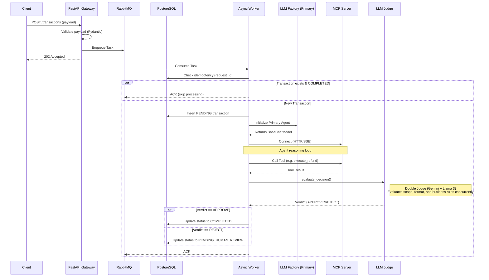

# Phase 1: Core Engine

## Architectural Overview

Phase 1 establishes the foundational, production-ready layer of the Agentic MCP Engine. It is designed to handle high-concurrency transactional workloads safely, cleanly isolating the generative capabilities of Large Language Models (LLMs) from the deterministic business logic and database states.

This phase is built around three core pillars:
1. **Event-Driven Asynchrony**: Offloading heavy AI inference from the critical API request path.
2. **Model Context Protocol (MCP)**: Enforcing a strict sandbox where the LLM can only mutate state via well-defined tool interfaces.
3. **Multi-Cloud Abstraction & Guardrails**: Allowing seamless LLM swapping while enforcing deterministic safety checks on all AI outputs before commit.

---

## Data Flow

The lifecycle of a single transaction flows through the following steps:

1. **Ingestion (FastAPI)**: The client submits a transaction request (e.g., a refund claim). The API Gateway validates the payload using Pydantic, instantly enqueues the task in RabbitMQ, and returns an HTTP `202 Accepted` to unblock the client.
2. **Task Consumption (Worker)**: An asynchronous worker (`aio-pika`) pulls the message from the RabbitMQ queue. 
3. **Idempotency Check (PostgreSQL)**: Before any expensive or side-effect-causing operation, the worker queries PostgreSQL for the `request_id`. If the transaction is already marked `COMPLETED`, the worker simply ACKs the message and skips execution.
4. **Agent Orchestration (LLM Factory)**: The worker provisions LLMs via the Abstract Factory (routing to Gemini, Vertex AI, Groq, GPT-4o, Bedrock, etc., based on environment config) and runs the project's own async orchestration loop — Prompt Guard, Double Judge, self-correction, Supreme Court cascade — rather than a LangChain agent loop. (The primary agent's proposed action is still mocked; replacing it with a real Front-Desk agent is Phase 1.E.) 
   - *Safe Mode (Mock)*: By default in local environments, the factory provisions a `FakeListChatModel` that returns deterministic, static JSON to simulate the agent without incurring network overhead or token costs, while still preserving the structural contract expected by the LLM Judge.
5. **Tool Execution (MCP Server)**: To fulfill the transaction, the LLM requests tool executions. The worker proxies these requests via HTTP/SSE to the standalone MCP Server, which validates authorization and executes the underlying domain logic.
6. **Guardrail Evaluation (Double LLM-as-a-Judge)**: Once the primary LLM determines its final proposed action, the worker pauses the flow. It sends the proposed action, arguments, and context to an independent, concurrent dual-judge system (Gemini and Llama 3). Both judges evaluate the action strictly for scope authorization, schema validity, and business rule compliance at temperature 0.0.
7. **Final Commit (PostgreSQL)**: 
   - If BOTH judges return `APPROVE`, the transaction is committed to the database as `COMPLETED`.
   - If EITHER judge returns `REJECT`, the transaction is saved as `PENDING_HUMAN_REVIEW`, preventing any automated financial execution.
8. **Message Acknowledgment**: The RabbitMQ message is definitively ACKed.

---

## Sequence Diagram

---

## Component Breakdown

The engine enforces strict layer isolation. Here is how the `src/` directory maps to the Phase 1 architecture:

- **`src/api/` (Ingestion Gateway)**: Contains the FastAPI routers and Pydantic schemas. Its only job is validation and enqueueing. It does not perform any business logic or LLM calls.
- **`src/worker/` (Async Consumer)**: The heart of the background processing. It manages the `aio-pika` connection, creates database sessions, enforces idempotency, and orchestrates the interaction between the LLM, the MCP Server, and the Guardrail Judge.
- **`src/mcp_server/` (Tool Sandbox)**: A standalone ASGI server exposing tools via HTTP/SSE. It acts as the execution layer. It never initiates LLM calls itself, and it acts as an isolated boundary preventing the AI from direct DB/system access.
- **`src/agents/` (AI Intelligence)**: Houses the `llm_factory.py` (which instantiates the correct underlying cloud model dynamically) and `judge.py` (the deterministic Double LLM-as-a-Judge interceptor running Gemini and Llama 3 concurrently).
- **`src/core/` (Domain Logic & Infrastructure)**: Contains shared resources: PostgreSQL connection singletons (`database.py`), SQLAlchemy models (`models.py`), and the `pydantic-settings` configuration definitions (`config.py`).
